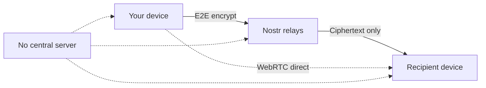

<p align="center">
  
</p>

<h1 align="center">GUPT</h1>

<p align="center">
  <strong>Your complete anonymous digital life.</strong><br />
  Encrypted chat, secure vault, and ephemeral sharing — with no phone number, no email, no account, and no central server.
</p>

<p align="center">
  <a href="https://gupt.app"></a>
  <a href="https://flathub.org/en/apps/com.besoeasy.gupt"></a>
  <a href="https://apps.umbrel.com/app/gupt"></a>
</p>

<p align="center">
  <a href="https://gupt.app">Website</a> ·
  <a href="https://github.com/besoeasy/gupt/issues">Issues</a> ·
  <a href="https://github.com/besoeasy/gupt/pkgs/container/gupt">Docker</a> ·
  <a href="./LICENSE">License</a>
</p>

---

## Why GUPT?

Most messengers ask you to trade privacy for convenience — a phone number, an email, a server that knows who you talk to. GUPT doesn't.

Built on [Nostr](https://nostr.com), a decentralized relay network, everything is **end-to-end encrypted on your device** before it ever leaves. Relays only see ciphertext. Your identity is a keypair you control — not an account someone else can suspend.

| | WhatsApp / Telegram | Signal | GUPT |
|---|---|---|---|
| Phone number required | Yes | Yes | **No** |
| Email / account required | Yes | Yes | **No** |
| Central server with user metadata | Yes | Yes | **No** |
| Censorship-resistant network | No | No | **Yes** (Nostr relays) |
| Self-hostable | No | No | **Yes** (Docker) |
| Built-in password vault | No | No | **Yes** |
| Ephemeral encrypted file sharing | No | No | **Yes** |
| Open web app — no install | No | No | **Yes** |

> A privacy-first alternative to Telegram, Signal, WhatsApp, and Discord — with WebRTC calls, encrypted media, and local-first storage.

---

## See it in action

<p align="center">
  
  &nbsp;
  
</p>

---

## Three pillars — one suite

GUPT isn't just a messenger. It's an all-in-one privacy toolkit that lives in your browser or on your desktop.

| | **Chat** | **Vault** | **Share** |
|---|---|---|---|
| **What** | Encrypted DMs, groups, voice & video calls | Passwords, 2FA secrets, private notes | Ephemeral encrypted file & text links |
| **Where stored** | Nostr relays (encrypted) | Nostr relays (encrypted) | Link-only — no account needed to open |
| **Best for** | Day-to-day conversations | Secrets you'd put in a password manager | One-off handoffs without exposing your identity |

---

## Get started in 30 seconds

**Web** — open and go, works on any device including mobile:

👉 **[gupt.app](https://gupt.app)**

**Docker** — self-host on your own server:

```bash
docker run -p 8000:8000 ghcr.io/besoeasy/gupt:latest
```

**Linux** — native desktop app via Flathub:

```bash
flatpak install flathub com.besoeasy.gupt
```

Or grab it from the [Flathub store](https://flathub.org/en/apps/com.besoeasy.gupt).

---

## Features

### Privacy & identity
- **Truly anonymous** — no phone number, no email, no signup flow
- Keypair-based identity with optional password + PIN protection (Argon2id)
- Deterministic avatars — no profile photo required
- **Temporary invites** — share a short-lived link instead of your permanent public key ([details below](#temporary-invites))
- Zero server-side user accounts or contact graphs

### Messaging
- End-to-end encrypted DMs (NIP-04 / NIP-59 gift-wrap)
- Group chats with member management and admin roles
- Replies, edits, reactions, emoji, and @mentions
- In-chat search with paginated history

### Voice & video
- WebRTC peer-to-peer voice and video calls
- Voice message recording and playback
- Incoming call notifications with ringtone

### Media
- Encrypted image, video, and audio sharing (AES-GCM before upload)
- Multi-mirror download with SHA-256 integrity verification
- Blossom, Originless, and IPFS storage backends

### Secure tools
- **Gupt Vault** — encrypted notes, passwords, and 2FA secrets on Nostr with optional auto-expiry
- **Secure Share** — ephemeral encrypted links anyone can decrypt, no Nostr account required

### Network & storage
- Runs on public Nostr relays — no single point of failure
- Configurable relay list with automatic primary relay selection
- Full offline cache in IndexedDB; auto-purge after 100 days or 10 GB
- Installable PWA plus native Linux app; dark and light themes

---

## How it works



1. **You** generate a keypair locally — that's your identity.
2. **Messages** are encrypted on your device, then published to Nostr relays.
3. **Relays** store and forward ciphertext — they never see plaintext.
4. **Calls** go peer-to-peer over WebRTC, not through a central server.
5. **Vault & Share** use the same encryption model — your keys, your data.

---

## Temporary invites

GUPT identities are public keys. To start a chat, two people need to exchange them — but dropping your permanent profile link in WhatsApp or Telegram leaves your pubkey in that chat history forever.

**Temporary invites** fix that. On **New chat**, generate a link you can safely share anywhere:

- **No plaintext pubkey** — the URL carries AES-GCM ciphertext, not your hex key or `npub`
- **Expires automatically** — 1 hour, 24 hours, or 7 days
- **Single-use** — revoked after the first open (best-effort via Nostr)
- **Works without trusting the chat app** — old messages don't permanently advertise your identity

| | Permanent profile link | Temporary invite |
|---|---|---|
| URL contains pubkey | Yes | No (encrypted token) |
| Stays valid | Forever | Until TTL or first use |
| Best for | Website, long-term contact | WhatsApp, SMS, one-off intros |

For day-to-day sharing in apps with persistent history, prefer a temporary invite.

---

## Offline notifications (PING)

No central server means no built-in push infrastructure. GUPT uses [ntfy.sh](https://ntfy.sh) for decentralized, anonymous wake-up pings.

When a contact is offline, tap **PING** in chat. They get a notification like:

> *"Hey its swift-fox-042 — come online on gupt.app"*

**To receive PINGs:**

1. Install the free [ntfy app](https://ntfy.sh) ([iOS](https://apps.apple.com/us/app/ntfy/id1625396347) · [Android](https://play.google.com/store/apps/details?id=io.heckel.ntfy))
2. Subscribe to a topic named **your public key** (hex format)

No phone number or email required — just your pubkey as the topic name.

---

## Self-host & deploy

GUPT is a static web app served by nginx. One command:

```bash
docker run -d -p 8000:8000 --name gupt ghcr.io/besoeasy/gupt:latest
```

Also available on the [Umbrel App Store](https://apps.umbrel.com/app/gupt) for home-server users.

**Build from source:**

```bash
git clone https://github.com/besoeasy/gupt.git
cd gupt
npm install
npm run build
npm run preview   # http://localhost:4173
```

---

## Tech stack

Vue 3 · Pinia · Vite · Tailwind CSS · Dexie (IndexedDB) · nostr-tools · WebRTC · Noble crypto

---

## License

[CC BY-NC 4.0](./LICENSE) — Attribution required, commercial use prohibited.