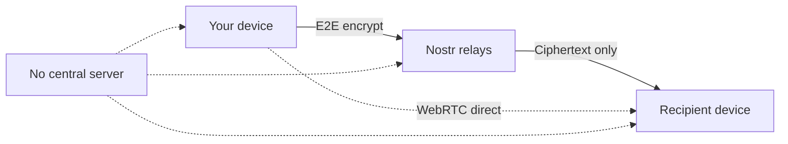

<p align="center">
  
</p>

<h1 align="center">GUPT</h1>

<p align="center">
  <strong>Your complete anonymous digital life.</strong><br />
  Encrypted chat, secure vault, and ephemeral sharing — with no phone number, no email, no account, and no central server.
</p>

<p align="center">
  <a href="https://gupt.app"></a>
  <a href="https://flathub.org/en/apps/com.besoeasy.gupt"></a>
  <a href="https://apps.umbrel.com/app/gupt"></a>
  <a href="https://vercel.com/new/clone?repository-url=https://github.com/besoeasy/gupt&project-name=gupt&repository-name=gupt"></a>
  <a href="https://app.netlify.com/start/deploy?repository=https://github.com/besoeasy/gupt"></a>
</p>

<p align="center">
  <a href="https://gupt.app">Website</a> ·
  <a href="https://github.com/besoeasy/gupt/issues">Issues</a> ·
  <a href="https://github.com/besoeasy/gupt/pkgs/container/gupt">Docker</a> ·
  <a href="./LICENSE">License</a>
</p>

---

## Why GUPT?

Most messengers ask you to trade privacy for convenience — a phone number, an email, a server that knows who you talk to. GUPT doesn't.

Built on [Nostr](https://nostr.com), a decentralized relay network, everything is **end-to-end encrypted on your device** before it ever leaves. Relays only see ciphertext. Your identity is a keypair you control — not an account someone else can suspend.

| | WhatsApp / Telegram | Signal | GUPT |
|---|---|---|---|
| Phone number required | Yes | Yes | **No** |
| Email / account required | Yes | Yes | **No** |
| Central server with user metadata | Yes | Yes | **No** |
| Censorship-resistant network | No | No | **Yes** (Nostr relays) |
| Self-hostable | No | No | **Yes** (Docker) |
| Built-in password vault | No | No | **Yes** |
| Ephemeral encrypted file sharing | No | No | **Yes** |
| Open web app — no install | No | No | **Yes** |

> A privacy-first alternative to Telegram, Signal, WhatsApp, and Discord — with WebRTC calls, encrypted media, and local-first storage.

---

## See it in action

<p align="center">
  
  &nbsp;
  
</p>

---

## Three pillars — one suite

GUPT isn't just a messenger. It's an all-in-one privacy toolkit that lives in your browser or on your desktop.

| | **Chat** | **Vault** | **Share** |
|---|---|---|---|
| **What** | Encrypted DMs, groups, voice & video calls | Passwords, 2FA secrets, private notes | Ephemeral encrypted file & text links |
| **Where stored** | Nostr relays (encrypted) | Nostr relays (encrypted) | Link-only — no account needed to open |
| **Best for** | Day-to-day conversations | Secrets you'd put in a password manager | One-off handoffs without exposing your identity |

---

## Quick start

| I want to… | Use |
|---|---|
| Just try it | 👉 [gupt.app](https://gupt.app) |
| Run it locally | `npx github:besoeasy/gupt` |
| Self-host with Docker | `docker run -p 8000:8000 ghcr.io/besoeasy/gupt:latest` |
| Deploy my own public URL | [Vercel](#-vercel--netlify) · [Netlify](#-vercel--netlify) |
| Native Linux app | `flatpak install flathub com.besoeasy.gupt` |

→ **[See all deployment options](#-deploy-gupt)**

---

## Features

### Privacy & identity
- **Truly anonymous** — no phone number, no email, no signup flow
- Keypair-based identity with optional password + PIN protection (Argon2id)
- Deterministic avatars — no profile photo required
- **Temporary invites** — share a short-lived link instead of your permanent public key ([details below](#temporary-invites))
- **Domain contact** — add a `gupt.` TXT record so people can message you by domain ([details below](#domain-contact))
- Zero server-side user accounts or contact graphs

### Messaging
- End-to-end encrypted DMs (NIP-04 / NIP-59 gift-wrap)
- Group chats with member management and admin roles
- Replies, edits, reactions, emoji, and @mentions
- In-chat search with paginated history

### Voice & video
- WebRTC peer-to-peer voice and video calls
- Voice message recording and playback
- Incoming call notifications with ringtone

### Media
- Encrypted image, video, and audio sharing (AES-GCM before upload)
- Multi-mirror download with SHA-256 integrity verification
- Blossom, Originless, and IPFS storage backends

### Secure tools
- **Gupt Vault** — encrypted notes, passwords, and 2FA secrets on Nostr with optional auto-expiry
- **Secure Share** — ephemeral encrypted links anyone can decrypt, no Nostr account required

### Network & storage
- Runs on public Nostr relays — no single point of failure
- Configurable relay list with automatic primary relay selection
- Full offline cache in IndexedDB; auto-purge after 100 days or 10 GB
- Installable PWA plus native Linux app; dark and light themes

---

## How it works



1. **You** generate a keypair locally — that's your identity.
2. **Messages** are encrypted on your device, then published to Nostr relays.
3. **Relays** store and forward ciphertext — they never see plaintext.
4. **Calls** go peer-to-peer over WebRTC, not through a central server.
5. **Vault & Share** use the same encryption model — your keys, your data.

### Nostr Data Structures

Gupt operates entirely on top of standard Nostr relays using a strict subset of event kinds to maintain privacy and compatibility:

| Feature | Nostr Kind | Description |
|---|---|---|
| **Public Profiles** | `0` | Standard Nostr metadata (display name, avatar hash, about text). |
| **Secure Share** | `1` | A public note advertising Gupt. The actual files/notes are encrypted and hidden inside a custom event tag. |
| **Temporary Invites**| `1` | An auto-expiring public ghost event. The encrypted pubkey payload is hidden inside a custom `gupt_invite` tag. |
| **Direct Messages** | `4` | Standard end-to-end encrypted direct messages (NIP-04). |
| **Gupt Vault** | `4` | Self-addressed encrypted DMs (sent to your own pubkey) containing your private notes and passwords. |
| **WebRTC Calls & Files** | `20004` | Ephemeral encrypted DMs for high-frequency WebRTC signaling (offers, answers, candidates, etc) that bypass relay rate-limiting. |
| **Typing Indicators** | `21004` | Ephemeral encrypted typing indicators for 1-on-1 chats. |

---

## Temporary invites

GUPT identities are public keys. To start a chat, two people need to exchange them — but dropping your permanent profile link in WhatsApp or Telegram leaves your pubkey in that chat history forever.

**Temporary invites** fix that. On **New chat**, generate a link you can safely share anywhere:

- **No plaintext pubkey** — the URL carries AES-GCM ciphertext, not your hex key or `npub`
- **Expires automatically** — 1 hour, 24 hours, or 7 days
- **Single-use** — revoked after the first open (best-effort via Nostr)
- **Works without trusting the chat app** — old messages don't permanently advertise your identity

| | Permanent profile link | Temporary invite |
|---|---|---|
| URL contains pubkey | Yes | No (encrypted token) |
| Stays valid | Forever | Until TTL or first use |
| Best for | Website, long-term contact | WhatsApp, SMS, one-off intros |

For day-to-day sharing in apps with persistent history, prefer a temporary invite.

---

## Domain contact

Let people start an encrypted chat using just your domain — no public key to copy, no account required. Perfect for **anonymous website support**: visitors stay private, you only expose a support key.

### For website owners

Add one TXT record to your DNS:

```
gupt.yourdomain.com.  TXT  "<your-64-char-hex-pubkey>"
```

You can also use your `npub1…` bech32 key as the TXT value.

In GUPT, open **Me → Identity** to copy the ready-made TXT record and a support link for your site.

**Subdomains work too** — publish TXT on `gupt.<subdomain>` and visitors enter the subdomain as-is:

| Visitor enters | TXT record |
|---|---|
| `besoeasy.com` | `gupt.besoeasy.com` |
| `support.besoeasy.com` | `gupt.support.besoeasy.com` |

```
gupt.support.besoeasy.com.  TXT  "<your-64-char-hex-pubkey>"
```

```html
<a href="https://gupt.app/#/new/start?domain=support.besoeasy.com">Anonymous support</a>
```

Each subdomain needs its own record. There is no wildcard or apex fallback — `support.besoeasy.com` will not read `gupt.besoeasy.com`.

### For visitors

On **[Start chat](https://gupt.app/#/new/start)**, enter a domain instead of a public key:

```
besoeasy.com
```

GUPT looks up `gupt.besoeasy.com`, reads the TXT record, and opens an end-to-end encrypted DM.

**Website button example:**

```html
<a href="https://gupt.app/#/new/start?domain=besoeasy.com">Anonymous support chat</a>
```

| | Temporary invite | Domain contact |
|---|---|---|
| Setup | Generate in app | One DNS TXT record |
| Visitor enters | Invite link | `yourdomain.com` |
| Best for | One-off intros in chat apps | Permanent support / contact page |
| Stays valid | Until TTL or first use | Until you update DNS |

---

## Offline notifications (PING)

No central server means no built-in push infrastructure. GUPT uses [ntfy.sh](https://ntfy.sh) for decentralized, anonymous wake-up pings.

When a contact is offline, tap **PING** in chat. They get a notification like:

> *"Hey its swift-fox-042 — come online on gupt.app"*

**To receive PINGs:**

1. Install the free [ntfy app](https://ntfy.sh) ([iOS](https://apps.apple.com/us/app/ntfy/id1625396347) · [Android](https://play.google.com/store/apps/details?id=io.heckel.ntfy))
2. Subscribe to a topic named **your public key** (hex format)

No phone number or email required — just your pubkey as the topic name.

---

---

## 🚀 Deploy GUPT

Every method runs the exact same app — choose what fits your comfort level and use case.

| Method | Who it's for | Effort | Cost |
|---|---|---|---|
| [gupt.app](#-web--guptapp) | Everyone | Zero | Free |
| [npx](#-npx--local-private-instance) | Developers & privacy-first users | One command | Free |
| [Docker](#-docker--vps--homelab) | Self-hosters, VPS users | One command | Server cost |
| [Vercel / Netlify](#-vercel--netlify--static-hosting) | Devs wanting their own public URL | One click | Free tier available |
| [Railway / Render](#-railway--render--container-hosting) | Devs preferring managed containers | One click | Free tier available |
| [Flatpak](#-flatpak--linux-desktop) | Linux desktop users | One command | Free |
| [Umbrel](#-umbrel--home-server) | Home server / self-sovereignty users | One click | Hardware only |
| [Build from source](#-build-from-source) | Contributors & power users | Dev setup | Free |

---

### 🌐 Web — gupt.app

**Target user:** Anyone. No setup, no install, works on every device including mobile.

Just open your browser and go:

👉 **[gupt.app](https://gupt.app)**

Your keys are generated locally and never leave your device. If you want zero trust in the hosting provider, run one of the options below instead.

---

### ⚡ npx — Local private instance

**Target user:** Developers and privacy-conscious users who want a fully local copy — no cloud, no third party, no network dependency beyond Nostr relays.

```bash
npx github:besoeasy/gupt
```

On first run npm clones the repo, builds the app, and starts a local server. Your browser opens automatically.

- ✅ Runs entirely on your machine
- ✅ No account, no signup
- ✅ Always the latest version from `main`
- ✅ Zero permanent install — cache is cleaned by npm automatically

---

### 🐳 Docker — VPS / homelab

**Target user:** Homelab enthusiasts, VPS owners, and teams who want a persistent private instance reachable from any of their devices.

```bash
# Run
docker run -d -p 8000:8000 --name gupt ghcr.io/besoeasy/gupt:latest

# Update to latest
docker pull ghcr.io/besoeasy/gupt:latest && docker restart gupt
```

Serves on `http://your-server:8000`. Put it behind a reverse proxy (Caddy, nginx, Traefik) for HTTPS.

- ✅ Always-on, accessible from any device on your network
- ✅ Multi-arch: `linux/amd64` and `linux/arm64` (Raspberry Pi, Apple Silicon servers)
- ✅ Trivial to update
- ℹ️ Requires a VPS, home server, or NAS

---

### ▲ Vercel / Netlify — Static hosting

**Target user:** Developers who want their own public-facing URL (e.g. `chat.yourdomain.com`) with global CDN performance, and zero server management.

| | |
|---|---|
| [](https://vercel.com/new/clone?repository-url=https://github.com/besoeasy/gupt&project-name=gupt&repository-name=gupt) | Auto-detects Vite — no config needed |
| [](https://app.netlify.com/start/deploy?repository=https://github.com/besoeasy/gupt) | Auto-detects Vite — no config needed |

- ✅ Free tier covers most personal use
- ✅ Global CDN, automatic HTTPS, custom domains
- ✅ Auto-deploys on every push to `main`
- ✅ No server to manage
- ℹ️ Best for sharing GUPT with friends/team on a custom domain

---

### 🚂 Railway / Render — Container hosting

**Target user:** Developers who prefer Docker-based managed infrastructure with auto-scaling, easy env vars, and one-click rollbacks.

| | |
|---|---|
| [](https://railway.com/new/template?template=https://github.com/besoeasy/gupt) | Uses the existing Dockerfile |
| [](https://render.com/deploy?repo=https://github.com/besoeasy/gupt) | Uses the existing Dockerfile |

- ✅ Managed infrastructure — no sysadmin work
- ✅ Free tier available on both platforms
- ✅ Auto-deploy on git push
- ℹ️ Slightly more overhead than Vercel/Netlify for a static app, but gives you full container control

---

### 🐧 Flatpak — Linux desktop

**Target user:** Linux desktop users who want GUPT as a proper native app — system tray, OS notifications, window management — without a browser tab.

```bash
flatpak install flathub com.besoeasy.gupt
gupt
```

Or install from the [Flathub store](https://flathub.org/en/apps/com.besoeasy.gupt) with one click.

- ✅ Native GTK4 / WebKit window
- ✅ Sandboxed with Flatpak permissions
- ✅ Updates via `flatpak update`
- ℹ️ Linux only (GNOME, KDE, etc.)

---

### 🏠 Umbrel — Home server

**Target user:** Users running [Umbrel OS](https://umbrel.com) on a home server or Raspberry Pi who want GUPT alongside their other self-hosted apps (Nextcloud, Vaultwarden, etc.).

Install from the [Umbrel App Store](https://apps.umbrel.com/app/gupt) — one click, no terminal needed.

- ✅ Runs on your local network, fully private
- ✅ Managed by Umbrel's update & backup system
- ✅ No command line required
- ℹ️ Requires an Umbrel home server

---

### 🔧 Build from source

**Target user:** Contributors, developers who want to run unreleased code, or anyone who wants to audit and modify every line before running it.

```bash
git clone https://github.com/besoeasy/gupt.git
cd gupt
npm install
npm run dev      # dev server with hot reload → http://localhost:5173
npm run build    # production build → dist/
npm run preview  # preview production build → http://localhost:4173
```

- ✅ Full control over the code
- ✅ Hot reload for development
- ✅ Can run your own fork with custom relays or features
- ℹ️ Requires Node.js ≥ 20

---

## Tech stack

Vue 3 · Pinia · Vite · Tailwind CSS · Dexie (IndexedDB) · nostr-tools · WebRTC · Noble crypto

---

## License

[CC BY-NC 4.0](./LICENSE) — Attribution required, commercial use prohibited.