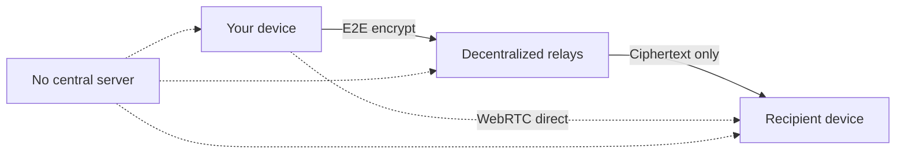

<p align="center">
  
</p>

<h1 align="center">GUPT</h1>

<p align="center">
  <strong>Your complete anonymous digital life.</strong><br />
  Encrypted chat, passwords, notes, bookmarks, and ephemeral sharing — with no phone number, no email, no account, and no central server.
</p>

<p align="center">
  <a href="https://gupt.app"></a>
  <a href="https://flathub.org/en/apps/com.besoeasy.gupt"></a>
  <a href="https://apps.umbrel.com/app/gupt"></a>
  <a href="https://vercel.com/new/clone?repository-url=https://github.com/besoeasy/gupt&project-name=gupt&repository-name=gupt"></a>
  <a href="https://app.netlify.com/start/deploy?repository=https://github.com/besoeasy/gupt"></a>
</p>

<p align="center">
  <a href="https://gupt.app">Website</a> ·
  <a href="https://github.com/besoeasy/gupt/issues">Issues</a> ·
  <a href="https://github.com/besoeasy/gupt/pkgs/container/gupt">Docker</a> ·
  <a href="./docs/README.md">Docs</a> ·
  <a href="./LICENSE">License</a>
</p>

---

## Why GUPT?

Most messengers ask you to trade privacy for convenience — a phone number, an email, a central server that logs who you talk to. **GUPT is fundamentally different.** It is not just another UI clone of WhatsApp or Telegram; it is a **100% browser-native, serverless, decentralized privacy suite**.

Built on a decentralized relay network, everything is **end-to-end encrypted on your device** before it ever leaves your browser. Relays only store and forward ciphertext. Your identity is a cryptographic keypair you control — not an account someone else can log, suspend, or subpoena.

### How GUPT is Different

| Feature / Architecture                              | WhatsApp & Telegram                       | Signal                 | GUPT                                                                                  |
| --------------------------------------------------- | ----------------------------------------- | ---------------------- | ------------------------------------------------------------------------------------- |
| **Phone number / Email required**                   | Yes                                       | Yes                    | **No** (Cryptographic keypairs only)                                                  |
| **Central servers & user databases**                | Yes                                       | Yes                    | **No** (100% Decentralized relay network)                                             |
| **Metadata & social graph protection**              | No (Servers log contacts)                 | Partial                | **Yes** (Client-side encryption before relay submission)                              |
| **In-browser execution & zero install**             | No                                        | No                     | **Yes** (Runs entirely in any web browser)                                            |
| **P2P WebRTC Voice/Video & Screen Share**           | No (Centralized calls)                    | No (Centralized calls) | **Yes** (Direct P2P WebRTC with relay signaling)                                      |
| **Encrypted media via Originless IPFS gateways**    | No                                        | No                     | **Yes** (`GET /ipfs/{cid}` on pin nodes, public gateway fallback)                     |
| **Encrypted Media Storage**                         | AWS / Central Cloud                       | AWS / Central Cloud    | **Stateless Originless IPFS Pinning**                                                 |
| **Self-Hostable Infrastructure**                    | No                                        | No                     | **Yes** (Docker, npx, static web, VPS)                                                |
| **Bot framework**                                   | Centralized Bot APIs                      | No                     | **Yes** ([gupt-sdk](https://www.npmjs.com/package/gupt-sdk) — full E2E bot framework) |
| **Encrypted notifications**                         | Vendor push (plaintext / server-mediated) | Vendor push            | **Yes** (encrypted DM to a GUPT pubkey — ntfy replacement)                            |
| **Built-in encrypted Passwords, Notes & Bookmarks** | No                                        | No                     | **Yes** (Relay-synced, client-encrypted streams)                                      |

### Why the alternatives are compromises

Every mainstream app asks you to trade privacy for convenience. The pattern is always the same: **give us your identity, trust our servers, and accept that we can see more than you think.** Here's what each one actually costs you:

| App | The compromise |
| --- | --- |
| **Telegram** | Not end-to-end encrypted by default — regular chats are stored as plaintext on Telegram's servers. Requires a phone number. Central servers see your full contact graph and message metadata. |
| **Signal** | Excellent E2E crypto, but still requires a phone number, runs on central servers, and its operators can see *who* talks to *whom* even if not *what* they say. No anonymous signup, no self-hosting. |
| **WhatsApp** | Owned by Meta. Requires a phone number, central servers, and cloud backups that are often not end-to-end encrypted. Your social graph is Meta's product. |
| **Password managers** | A separate account, a separate subscription, a separate company holding your secrets — with a sync server that at least *could* read them. |
| **Notes & bookmark apps** | Another account, another cloud, another place where your private writing and browsing history sit in plaintext. |
| **File-sharing services** | Require an account, leave a trail, and store your files on someone else's servers. |

The common thread: **your identity, your metadata, and your data all live on someone else's servers.** GUPT removes all three — your identity is a keypair, your metadata is minimized, and your data is ciphertext on relays you choose.

---

### What Makes GUPT Unique

1. ⚡ **100% In-Browser Engine**: Runs completely inside your web browser. Local storage uses IndexedDB (`idb.js`), local encryption uses WebCrypto & Noble crypto, and encrypted media is fetched from Originless `GET /ipfs/{cid}` gateways.
2. 🔑 **Zero Server Accounts & Censorship Resistance**: No sign-up, no phone numbers, no email addresses. Accounts cannot be blocked, banned, or shut down because there is no central server.
3. 📞 **P2P Audio/Video & Screen Sharing**: WebRTC calls and screen sharing connect directly peer-to-peer between browsers, protected by a built-in trusted contact threshold (`sentCount >= 7`).
4. 🌐 **Stateless Originless Media & Redundancy**: Media attachments are encrypted client-side before being pinned onto IPFS across redundant Originless nodes with automatic multi-server failover.

---

## Why everything is here

GUPT is one suite, not a bundle of separate apps. Every tool exists because the mainstream alternative forces the same compromise: **a separate account, a separate company, and a separate server that holds your data.** Here's the need behind each piece — and why it can't be solved by "just using another app."

### 💬 Chat — messaging shouldn't require your phone number

Telegram, WhatsApp, and Signal all demand a phone number, tying your conversations to your real identity and letting the operator build a contact graph. GUPT's identity is a keypair you generate — no number, no email, no account anyone can suspend.

### 📞 Calls — calls shouldn't route through a company's servers

Voice, video, and screen sharing on mainstream apps run through centralized infrastructure that can be tapped, logged, or shut down. GUPT calls are peer-to-peer WebRTC — media goes directly between devices, with only ephemeral encrypted signaling on relays.

### 🖼️ Media — uploads shouldn't be tied to your identity

Cloud storage and chat apps attach your uploads to an account and store them in plaintext. GUPT encrypts files client-side (AES-GCM) before pinning them to stateless Originless IPFS nodes — the storage layer never sees the content or your identity.

### 🔑 Passwords — secrets shouldn't live in a cloud you don't control

Password managers store your credentials on their servers. Even "zero-knowledge" ones are a single company you must trust. GUPT keeps passwords in your own encrypted stream on relays you choose — the ciphertext is meaningless to anyone without your key.

### 📝 Notes — private writing shouldn't be plaintext on a server

Notes apps sync your writing through a company's cloud, often unencrypted. GUPT notes are encrypted Markdown in a self-addressed stream — only you can read them, and they sync across your devices for free.

### 🔖 Bookmarks — your browsing history shouldn't be a company's data

Bookmark and "read later" services store what you browse — a rich profile for anyone who runs them. GUPT bookmarks are encrypted page saves, captured in one click with gupt-mark, with no plaintext history anywhere.

### 📤 Share — one-off handoffs shouldn't expose your identity

File-sharing services make you create an account and leave a trail. GUPT Secure Share creates ephemeral encrypted links — anyone can open them, no account, and nothing links back to you.

### 🤖 Bots — automation shouldn't mean handing a platform your data

Bot platforms are centralized: the platform sees every message. GUPT bots run on [`gupt-sdk`](./sdk/README.md) with their own keypair and talk end-to-end encrypted — the bot operator, not a platform, controls the automation.

### 🔔 Notifications — push shouldn't be plaintext

Push notifications from mainstream apps are plaintext or server-mediated. GUPT's encrypted notifications send an E2E-encrypted DM to your account — CI jobs, backups, and agents can reach you without a third party reading the payload.

---

## See it in action

<p align="center">
  
  &nbsp;
  
</p>

---

## Bots

GUPT has various bots you can message from [gupt.app](https://gupt.app) like any contact. In the app, **Talk to bot** (next to New Chat) shows a random set discovered via the public `gupt-bot` tag. See them all at **[t3nklabs/gupt-bots](https://github.com/t3nklabs/gupt-bots)**.

A bot is a Node.js process with its **own** keypair — never reuse a personal GUPT identity. Build yours with [`gupt-sdk`](./sdk/README.md) and set `publicBot: { name, about, owner?, website?, bitcoin? }` to list it.

---

## Encrypted notifications — replace ntfy

[ntfy.sh](https://ntfy.sh) posts plaintext to a public topic. GUPT posts an **end-to-end encrypted DM** to your account. CI jobs, backups, deploys, and AI agents send the update; it lands in your GUPT chat — only your key can decrypt it.

```
Learn how to use https://www.npmjs.com/package/gupt-sdk

You can use it to send encrypted notifications to a user on their GUPT account.

It is a full bot framework.
```

|                 | ntfy.sh                    | GUPT                         |
| --------------- | -------------------------- | ---------------------------- |
| Address         | Public topic string        | Your 64-char GUPT public key |
| Payload         | Plaintext on the server    | Encrypted DM on relays       |
| Where it lands  | ntfy app                   | Your GUPT chat               |
| Who can read it | Anyone who knows the topic | Only you                     |

```js
import { GuptBot } from "gupt-sdk";

const bot = new GuptBot({
  secretHex: process.env.GUPT_BOT_KEY,
  relays: ["wss://relay.damus.io", "wss://nos.lol"],
});

await bot.start();
await bot.reply(process.env.GUPT_USER_PUBKEY, "Backup completed successfully");
await bot.stop();
```

`GUPT_BOT_KEY` is a **dedicated bot** secret — never your personal GUPT identity. `GUPT_USER_PUBKEY` is your public key from **Me** in the app. Use at least two `wss://` relays you also use in GUPT. Full API: [`gupt-sdk`](./sdk/README.md).

This is the message body. [PING](#offline-notifications-ping) is a separate wake-up ping while GUPT is fully closed.

<table>
<tr>
<td>

**AI agent skill — send updates to a GUPT account**

Drop [`SKILL.md`](./SKILL.md) into your agent's skills folder.

When asked to notify, alert, or send status to GUPT (instead of ntfy):

1. `npm i gupt-sdk`
2. Env: `GUPT_BOT_KEY` (bot secret) + `GUPT_USER_PUBKEY` (recipient)
3. `await bot.reply(process.env.GUPT_USER_PUBKEY, text)` after `bot.start()`
4. Never reuse a personal key. Never log secrets. Text cap 8000 chars.
5. Not OS push while GUPT is closed — that is still ntfy PING.

</td>
</tr>
</table>

---

## Privacy tools — one suite

GUPT isn't just a messenger. It's an all-in-one privacy toolkit that lives in your browser or on your desktop.

|              | **Chat**                             | **Passwords**                         | **Notes**                    | **Bookmarks**                    | **Share**                                  |
| ------------ | ------------------------------------ | ------------------------------------- | ---------------------------- | -------------------------------- | ------------------------------------------ |
| **What**     | Encrypted DMs, groups, voice & video | Logins, emails, TOTP / 2FA, multi-URL | Markdown notes with tags     | Encrypted page saves + gupt-mark | Ephemeral encrypted file & text links      |
| **Where**    | Relays (ciphertext)                  | Relays (`gupt_password`)              | Relays (`gupt_note`)         | Relays (`gupt_bookmark`)         | Link-only — no account to open             |
| **Best for** | Day-to-day conversations             | Credential storage                    | Private writing & checklists | Capture-anything browsing        | One-off handoffs without exposing identity |

---

## Encrypted Passwords, Notes & Bookmarks

These three tools are separate encrypted streams (not a single vault). Each is Kind `1` — readable marker in `content`, secrets only in a custom tag — with **100-day expiry**, tombstone deletes (no Kind 5), Dexie cache-first reads, and hybrid auto-renewal when you open the page.

| Tool          | Route                                         | Public `#t` + ciphertext tag | Payload (encrypted)                                                         |
| ------------- | --------------------------------------------- | ---------------------------- | --------------------------------------------------------------------------- |
| **Passwords** | [`#/passwords`](https://gupt.app/#/passwords) | `gupt_password`              | `title`, `username`, `email`, `password`, `uris[]`, `totp`, `notes`, `tags` |
| **Notes**     | [`#/notes`](https://gupt.app/#/notes)         | `gupt_note`                  | `title`, `body` (Markdown), `tags`                                          |
| **Bookmarks** | [`#/bookmarks`](https://gupt.app/#/bookmarks) | `gupt_bookmark`              | `title`, `url`, `tags`                                                      |

### Passwords

Store logins the way a password manager should: structured fields, optional TOTP secret with a live 6-digit code, multiple site URLs per entry, and tags for filtering. Copy username / password / authenticator code from the detail sheet. Sync across devices via relays; never leave plaintext on a server.

### Notes

Private Markdown notes — headings, lists, links, code — rendered safely in-app. Title is optional (derived from the first line if empty). Tag and search like the other streams.

### Bookmarks

Save pages from inside gupt, or use **gupt-mark** (below) to capture any site in one click. Optional comma-separated tags at save time. Open, filter, or inspect the underlying Nostr event on njump.me.

### Shared behaviour

- **Write → relays**, then cache in IndexedDB
- **Read → Dexie cache first**, then refresh from relays
- **Delete** publishes a long-lived tombstone (`deleted: true`) so the logical id stays gone across devices
- **Renewal** on each visit: urgent items within 90 days of expiry (up to 3), otherwise a 50% chance to renew the oldest entry
- Background **replication** republishes Kind `1` events (including these streams) to more relays over time

---

## Quick start

| I want to…                    | Use                                                                                           |
| ----------------------------- | --------------------------------------------------------------------------------------------- |
| Just try it                   | 👉 [gupt.app](https://gupt.app)                                                               |
| Try GUPT bots                 | [Various bots](https://github.com/t3nklabs/gupt-bots)                                         |
| Build your own bot            | [`gupt-sdk`](./sdk/README.md)                                                                 |
| Notify my GUPT (replace ntfy) | [Encrypted notifications](#encrypted-notifications--replace-ntfy) · [agent skill](./SKILL.md) |
| Run it locally                | `npx github:besoeasy/gupt`                                                                    |
| Self-host with Docker         | `docker run -p 8000:8000 ghcr.io/besoeasy/gupt:latest`                                        |
| Deploy my own public URL      | [Vercel](#-vercel--netlify) · [Netlify](#-vercel--netlify)                                    |
| Native Linux app              | `flatpak install flathub com.besoeasy.gupt`                                                   |

→ **[See all deployment options](#-deploy-gupt)**

---

## Features

### Privacy & identity

- **Truly anonymous** — no phone number, no email, no signup flow
- Keypair-based identity from memory anchors or a pasted secret, hardened with Argon2id
- Deterministic avatars — no profile photo required
- **Temporary invites** — share a short-lived link instead of your permanent public key ([details below](#temporary-invites))
- **Domain contact** — add a `gupt.` TXT record so people can message you by domain ([details below](#domain-contact))
- Zero server-side user accounts or contact graphs

### Messaging

- End-to-end encrypted DMs
- Group chats with member management and admin roles
- Replies, edits, reactions, emoji, and @mentions
- In-chat search with paginated history

### Voice & video

- WebRTC peer-to-peer voice and video calls
- **In-Call Screen Sharing** — share desktop / browser tabs live during WebRTC calls
- Trusted contact call protection threshold (`sentCount >= 7`)
- Voice message recording and playback with speed controls
- Incoming call notifications with customizable ringtone

### Media

- Encrypted image, video, and audio sharing (AES-GCM before upload)
- **Multi-Server Originless Upload** — parallel uploads with automatic failover and IPFS pinning
- Encrypted media download from Originless `GET /ipfs/{cid}` with public IPFS gateway fallback
- Multi-mirror download with SHA-256 integrity verification

### Secure tools

- **Passwords** — encrypted logins with username, email, multi-URL sites, TOTP / 2FA codes, tags, and auto-renewal
- **Notes** — encrypted Markdown notes with tags, search, and auto-renewal
- **Bookmarks** — encrypted page bookmarks with gupt-mark bookmarklet, tags, and auto-renewal
- **Secure Share** — ephemeral encrypted links anyone can decrypt, no account required
- **Bots** — various GUPT bots at [gupt-bots](https://github.com/t3nklabs/gupt-bots); build your own with [`gupt-sdk`](./sdk/README.md)
- **Encrypted notifications** — send CI, backup, and agent updates as DMs to a GUPT pubkey ([replace ntfy](#encrypted-notifications--replace-ntfy))

### Network & storage

- Runs on public decentralized relays — no single point of failure
- Configurable relay list with automatic primary relay selection
- Full offline cache in IndexedDB; auto-purge after 100 days or 10 GB
- Installable PWA plus native Linux app; dark and light themes

---

## How it works



1. **You** generate a keypair locally — that's your identity.
2. **Messages** are encrypted on your device, then published to decentralized relays.
3. **Relays** store and forward ciphertext — they never see plaintext.
4. **Calls** go peer-to-peer over WebRTC, not through a central server.
5. **Passwords, Notes, Bookmarks & Share** use the same encryption model — your keys, your data.

### Data Structures

GUPT uses a strict subset of event kinds for relay communication:

| Feature                  | Event Kind | Description                                                                                                                         |
| ------------------------ | ---------- | ----------------------------------------------------------------------------------------------------------------------------------- |
| **Public Profiles**      | `0`        | Metadata (display name, avatar hash, about text).                                                                                   |
| **Secure Share**         | `1`        | A public note advertising GUPT. The actual files/notes are encrypted and hidden inside a custom event tag.                          |
| **Temporary Invites**    | `1`        | An auto-expiring public ghost event. The encrypted public key payload is hidden inside a custom `gupt_invite` tag.                  |
| **Direct Messages**      | `4`        | Standard end-to-end encrypted direct messages.                                                                                      |
| **Passwords**            | `1`        | Self-addressed encrypted logins — `gupt_password` tag holds ciphertext (title, username, email, password, uris, totp, notes, tags). |
| **Notes**                | `1`        | Self-addressed encrypted Markdown — `gupt_note` tag holds ciphertext (title, body, tags).                                           |
| **Bookmarks**            | `1`        | Self-addressed encrypted bookmarks — `gupt_bookmark` tag holds ciphertext (title, url, tags).                                       |
| **Public bots**          | `1`        | Directory listing — `#t` `gupt-bot` plus a public `{ name, about, owner?, website?, bitcoin? }` tag. Author pubkey is the bot to message.     |
| **WebRTC Calls & Files** | `20004`    | Ephemeral encrypted DMs for high-frequency WebRTC signaling (offers, answers, candidates, etc) that bypass relay rate-limiting.     |
| **Typing Indicators**    | `21004`    | Ephemeral encrypted typing indicators for 1-on-1 chats.                                                                             |

---

## Temporary invites

GUPT identities are public keys. To start a chat, two people need to exchange them — but dropping your permanent profile link in WhatsApp or Telegram leaves your public key in that chat history forever.

**Temporary invites** fix that. On **New chat**, generate a link you can safely share anywhere:

- **No plaintext public key** — the URL carries a random one-time token; the AES-GCM ciphertext lives on a relay under a `gupt_invite_<token>` hashtag
- **Expires automatically** — 1 hour, 24 hours, or 7 days
- **Single-use** — revoked after the first open
- **Works without trusting the chat app** — old messages don't permanently advertise your identity

|                         | Permanent profile link     | Temporary invite              |
| ----------------------- | -------------------------- | ----------------------------- |
| URL contains public key | Yes                        | No (encrypted token)          |
| Stays valid             | Forever                    | Until TTL or first use        |
| Best for                | Website, long-term contact | WhatsApp, SMS, one-off intros |

For day-to-day sharing in apps with persistent history, prefer a temporary invite.

---

## Domain contact

Let people start an encrypted chat using just your domain — no public key to copy, no account required. Perfect for **anonymous website support**: visitors stay private, you only expose a support key.

### For website owners

Add one TXT record to your DNS:

```
gupt.yourdomain.com.  TXT  "<your-64-char-hex-pubkey>"
```

You can also use your full public key as the TXT value.

In GUPT, open **Me → Identity** to copy the ready-made TXT record and a support link for your site.

**Subdomains work too** — publish TXT on `gupt.<subdomain>` and visitors enter the subdomain as-is:

| Visitor enters         | TXT record                  |
| ---------------------- | --------------------------- |
| `besoeasy.com`         | `gupt.besoeasy.com`         |
| `support.besoeasy.com` | `gupt.support.besoeasy.com` |

```
gupt.support.besoeasy.com.  TXT  "<your-64-char-hex-pubkey>"
```

```html
<a href="https://gupt.app/#/new/start?domain=support.besoeasy.com">Anonymous support</a>
```

Each subdomain needs its own record. There is no wildcard or apex fallback — `support.besoeasy.com` will not read `gupt.besoeasy.com`.

### For visitors

On **[Start chat](https://gupt.app/#/new/start)**, enter a domain instead of a public key:

```
besoeasy.com
```

GUPT looks up `gupt.besoeasy.com`, reads the TXT record, and opens an end-to-end encrypted DM.

**Website button example:**

```html
<a href="https://gupt.app/#/new/start?domain=besoeasy.com">Anonymous support chat</a>
```

|                | Temporary invite            | Domain contact                   |
| -------------- | --------------------------- | -------------------------------- |
| Setup          | Generate in app             | One DNS TXT record               |
| Visitor enters | Invite link                 | `yourdomain.com`                 |
| Best for       | One-off intros in chat apps | Permanent support / contact page |
| Stays valid    | Until TTL or first use      | Until you update DNS             |

---

## Offline notifications (PING)

No central server means no built-in push infrastructure. GUPT uses [ntfy.sh](https://ntfy.sh) for decentralized, anonymous wake-up pings.

When a contact is offline, tap **PING** in chat. They get a notification like:

> _"Hey its swift-fox-042 — come online on gupt.app"_

**To receive PINGs:**

1. Install the free [ntfy app](https://ntfy.sh) ([iOS](https://apps.apple.com/us/app/ntfy/id1625396347) · [Android](https://play.google.com/store/apps/details?id=io.heckel.ntfy))
2. Subscribe to a topic named **your public key** (hex format)

No phone number or email required — just your pubkey as the topic name.

PING is a **wake-up** on a public ntfy topic. For the actual status payload (CI, backups, agents), send an encrypted DM to your GUPT account instead — [Encrypted notifications](#encrypted-notifications--replace-ntfy).

---

## gupt-mark (Bookmarks)


Save any page to your encrypted **Bookmarks** without leaving the site you're on — no copy-paste, no forms.

GUPT ships a **bookmarklet**: a tiny bookmark that, when clicked on any page, captures the **page URL** and **title**, then opens the gupt web app at [`#/hotlink/bookmark`](https://gupt.app/#/hotlink/bookmark) with that data. A preview card shows what was captured, counts down **3 → 0**, then **auto-saves** an encrypted bookmark (Kind 1, `gupt_bookmark` tag, 100-day expiry) to your relays. You can also hit **Save now** to skip the countdown or **Cancel** to discard.

### Install

1. Open the **Bookmarks** tab in gupt.
2. Drag the **gupt-mark** button onto your browser's bookmarks bar.

That's it — the button is now a click-anywhere-to-save shortcut.

### How it works

The bookmarklet builds a deep link into the web app (no server involved — capture, encryption, and save all happen in your browser):

```text
https://gupt.app/#/hotlink/bookmark?url=…&title=…
```

| Step                    | What happens                                                    |
| ----------------------- | --------------------------------------------------------------- |
| 1 · Click bookmarklet   | Captures `location.href` and page title                         |
| 2 · Open deep link      | The gupt app opens the `/hotlink/bookmark` route with that data |
| 3 · Preview + countdown | Shows the captured page and a 3-second auto-save countdown      |
| 4 · Auto-save           | Encrypts locally and publishes a Kind 1 bookmark event          |
| 5 · Done                | Redirects to Bookmarks where the new item appears               |

> **Note:** saving requires a signed-in **account** (not an ephemeral guest session). If you're not signed in, the hotlink shows a _Sign in to save_ screen linking to your account page.

### Self-hosting on a different domain

The bookmarklet deep-links to the **current origin** — whatever domain you're running the app on. So a self-hosted instance at `https://gupt.example.com` generates a bookmarklet that opens `https://gupt.example.com/#/hotlink/bookmark` automatically; no configuration needed.

---

## 🚀 Deploy GUPT

Every method runs the exact same app — choose what fits your comfort level and use case.

| Method                                                   | Who it's for                         | Effort      | Cost                |
| -------------------------------------------------------- | ------------------------------------ | ----------- | ------------------- |
| [gupt.app](#-web--guptapp)                               | Everyone                             | Zero        | Free                |
| [npx](#-npx--local-private-instance)                     | Developers & privacy-first users     | One command | Free                |
| [Docker](#-docker--vps--homelab)                         | Self-hosters, VPS users              | One command | Server cost         |
| [Vercel / Netlify](#-vercel--netlify--static-hosting)    | Devs wanting their own public URL    | One click   | Free tier available |
| [Railway / Render](#-railway--render--container-hosting) | Devs preferring managed containers   | One click   | Free tier available |
| [Flatpak](#-flatpak--linux-desktop)                      | Linux desktop users                  | One command | Free                |
| [Umbrel](#-umbrel--home-server)                          | Home server / self-sovereignty users | One click   | Hardware only       |
| [Build from source](#-build-from-source)                 | Contributors & power users           | Dev setup   | Free                |

---

### 🛰️ Run your own relay (recommended)

GUPT stores everything on relays — and most public Nostr relays only accept events whose timestamp is within ~2 days of the current clock. GUPT events are designed to live much longer: messages carry long expirations, and your Passwords, Notes & Bookmarks streams self-renew over **100 days**. On a strict public relay, re-published or older events can be rejected — meaning your data may not survive there.

**Recommendation:** run at least one relay yourself, even a local one on your own computer, and make sure it accepts events with older timestamps. Add it to your relay list in **Settings → Servers → Relay**. Your own relay becomes a durable home for your long-lived events, independent of public relay retention policies.

---

### 🌐 Web — gupt.app

**Target user:** Anyone. No setup, no install, works on every device including mobile.

Just open your browser and go:

👉 **[gupt.app](https://gupt.app)**

Your keys are generated locally and never leave your device. If you want zero trust in the hosting provider, run one of the options below instead.

---

### ⚡ npx — Local private instance

**Target user:** Developers and privacy-conscious users who want a fully local copy — no cloud, no third party, no network dependency beyond decentralized relays.

```bash
npx github:besoeasy/gupt
```

On first run npm clones the repo, builds the app, and starts a local server. Your browser opens automatically.

- ✅ Runs entirely on your machine
- ✅ No account, no signup
- ✅ Always the latest version from `main`
- ✅ Zero permanent install — cache is cleaned by npm automatically

---

### 🐳 Docker — VPS / homelab

**Target user:** Homelab enthusiasts, VPS owners, and teams who want a persistent private instance reachable from any of their devices.

```bash
# Run
docker run -d -p 8000:8000 --name gupt ghcr.io/besoeasy/gupt:latest

# Update to latest
docker pull ghcr.io/besoeasy/gupt:latest && docker restart gupt
```

Serves on `http://your-server:8000`. Put it behind a reverse proxy (Caddy, nginx, Traefik) for HTTPS.

- ✅ Always-on, accessible from any device on your network
- ✅ Multi-arch: `linux/amd64` and `linux/arm64` (Raspberry Pi, Apple Silicon servers)
- ✅ Trivial to update
- ℹ️ Requires a VPS, home server, or NAS

---

### ▲ Vercel / Netlify — Static hosting

**Target user:** Developers who want their own public-facing URL (e.g. `chat.yourdomain.com`) with global CDN performance, and zero server management.

|                                                                                                                                                                         |                                      |
| ----------------------------------------------------------------------------------------------------------------------------------------------------------------------- | ------------------------------------ |
| [](https://vercel.com/new/clone?repository-url=https://github.com/besoeasy/gupt&project-name=gupt&repository-name=gupt) | Auto-detects Vite — no config needed |
| [](https://app.netlify.com/start/deploy?repository=https://github.com/besoeasy/gupt)                 | Auto-detects Vite — no config needed |

- ✅ Free tier covers most personal use
- ✅ Global CDN, automatic HTTPS, custom domains
- ✅ Auto-deploys on every push to `main`
- ✅ No server to manage
- ℹ️ Best for sharing GUPT with friends/team on a custom domain

---

### 🚂 Railway / Render — Container hosting

**Target user:** Developers who prefer Docker-based managed infrastructure with auto-scaling, easy env vars, and one-click rollbacks.

|                                                                                                                                               |                              |
| --------------------------------------------------------------------------------------------------------------------------------------------- | ---------------------------- |
| [](https://railway.com/new/template?template=https://github.com/besoeasy/gupt)            | Uses the existing Dockerfile |
| [](https://render.com/deploy?repo=https://github.com/besoeasy/gupt) | Uses the existing Dockerfile |

- ✅ Managed infrastructure — no sysadmin work
- ✅ Free tier available on both platforms
- ✅ Auto-deploy on git push
- ℹ️ Slightly more overhead than Vercel/Netlify for a static app, but gives you full container control

---

### 🐧 Flatpak — Linux desktop

**Target user:** Linux desktop users who want GUPT as a proper native app — system tray, OS notifications, window management — without a browser tab.

```bash
flatpak install flathub com.besoeasy.gupt
gupt
```

Or install from the [Flathub store](https://flathub.org/en/apps/com.besoeasy.gupt) with one click.

- ✅ Native GTK4 / WebKit window
- ✅ Sandboxed with Flatpak permissions
- ✅ Updates via `flatpak update`
- ℹ️ Linux only (GNOME, KDE, etc.)

---

### 🏠 Umbrel — Home server

**Target user:** Users running [Umbrel OS](https://umbrel.com) on a home server or Raspberry Pi who want GUPT alongside their other self-hosted apps (Nextcloud, Vaultwarden, etc.).

Install from the [Umbrel App Store](https://apps.umbrel.com/app/gupt) — one click, no terminal needed.

- ✅ Runs on your local network, fully private
- ✅ Managed by Umbrel's update & backup system
- ✅ No command line required
- ℹ️ Requires an Umbrel home server

---

### 🔧 Build from source

**Target user:** Contributors, developers who want to run unreleased code, or anyone who wants to audit and modify every line before running it.

```bash
git clone https://github.com/besoeasy/gupt.git
cd gupt
npm install
npm run dev      # dev server with hot reload → http://localhost:5173
npm run build    # production build → dist/
npm run preview  # preview production build → http://localhost:4173
```

- ✅ Full control over the code
- ✅ Hot reload for development
- ✅ Can run your own fork with custom relays or features
- ℹ️ Requires Node.js ≥ 24

---

## Tech stack

Vue 3 · Pinia · Vite · Tailwind CSS · Dexie (IndexedDB) · Noble crypto · Helia IPFS · WebRTC

---

## License

[CC BY-NC 4.0](./LICENSE) — Attribution required, commercial use prohibited.
